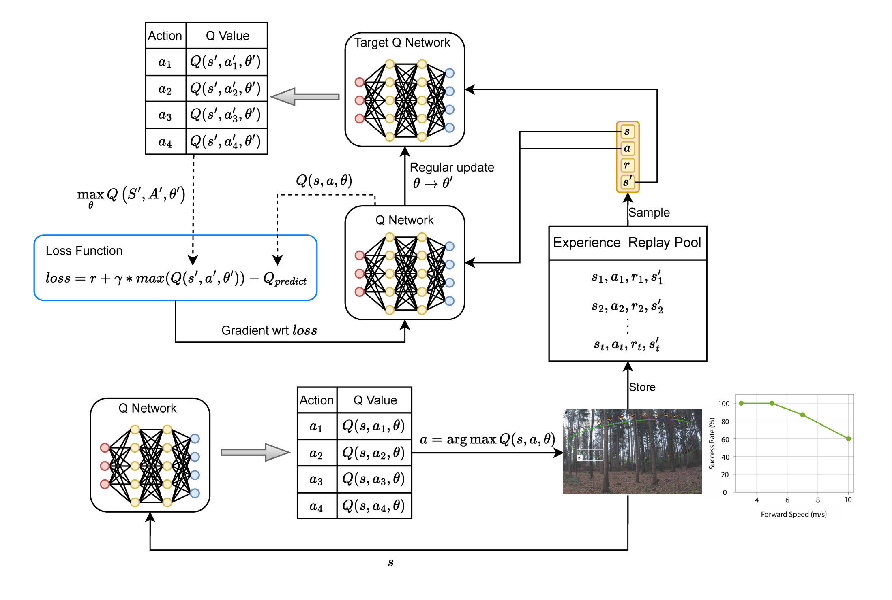
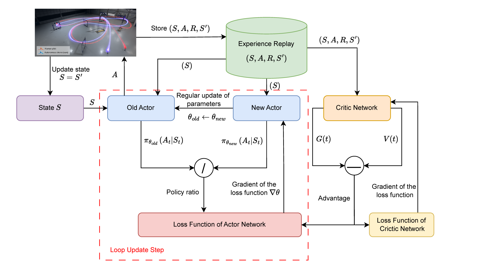
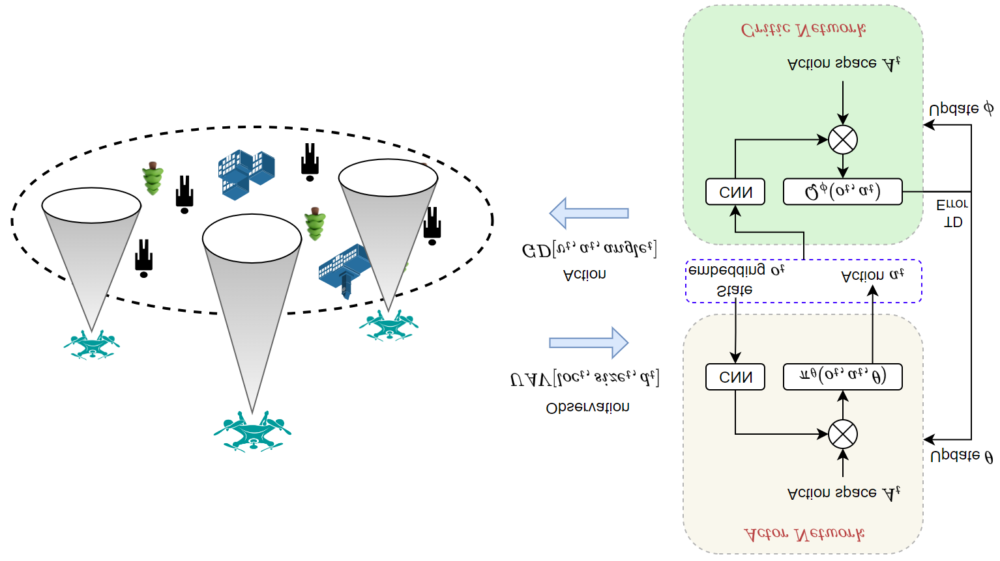

# First paper summary: RL methods for UAV systems

## Paper details

- **Title:** A Survey on Reinforcement Learning Methods for UAV Systems
- **Venue:** ACM Computing Surveys
- **Year:** 2025
- **DOI:** https://doi.org/10.1145/3769426
- **Length:** 37 pages

## Why this paper matters

This is a broad, high-quality survey of how reinforcement learning (RL) is used in UAV systems. It is useful for both commercial and defence contexts because it connects core autonomy methods (navigation, control, scheduling, edge intelligence) to practical UAV mission settings.

## Core contribution (in simple terms)

The paper organizes RL-for-UAV research by **algorithm family** and by **application scenario**:

- **RL families:** value-based, policy-based, actor-critic (AC)
- **Application scenarios:** trajectory planning, data collection, resource scheduling, edge computing

It also reviews major challenges and gives future directions (sample efficiency, sparse rewards, multi-UAV cooperation, sim-to-real, security/privacy, and LLM-assisted RL).

## Main takeaways

- RL is attractive for UAV autonomy because it can adapt in dynamic environments where PID/MPC or fixed planners struggle.
- Deep RL is especially useful in high-dimensional decision spaces, but training stability and data efficiency remain major issues.
- Multi-UAV systems are a strong trend, especially with MARL and CTDE-style training/execution.
- For high-stakes UAV use (commercial safety-critical or defence), interpretability, robustness, and security/privacy are still open problems.
- Sim-to-real transfer remains one of the largest practical barriers to deployment.

## Scientific topics with commercial/defence relevance

- **Autonomous navigation and obstacle avoidance** (inspection, logistics, ISR)
- **Data collection and sensing optimization** (smart cities, precision agriculture, battlefield sensing)
- **Resource scheduling and task allocation** (fleet operations, swarm mission efficiency)
- **Edge computing/offloading for UAV networks** (low-latency decision support)
- **Anti-jamming and secure autonomy** (resilience in contested environments)

## Copied charts/tables from the paper

### Table 1 (copied): Navigation performance comparison

Source in paper: **Table 1. UAV Navigation Performance of RL-Based Method and Other Methods**

| Scenario | Method | AMP | AP | AT | SR |
|---|---:|---:|---:|---:|---:|
| Navigation (static obstacles) | APF | 11.6951 | 17.0359 | 14.07 | 25% |
| Navigation (static obstacles) | CLPPO-GIC | 4.1734 | 8.8403 | 0.10 | 77% |
| Navigation (dynamic obstacles) | APF | 9.2426 | 16.5522 | 17.19 | 50% |
| Navigation (dynamic obstacles) | CLPPO-GIC | 7.9536 | 15.5182 | 0.10 | 68% |

**Interpretation:** RL-based CLPPO-GIC outperforms APF on success rate and path/time metrics in both static and dynamic obstacle settings.

### Table 2 (copied): Data collection performance comparison

Source in paper: **Table 2. UAV Data Collection Performance of RL-Based Method and Other Methods**

| Method | Time utilization ratio | Energy consumption |
|---|---:|---:|
| DRL-UTPS | 0.3095% | 2.182e4 |
| GBA | 0.1694% | 4.019e4 |
| CPP-SDA | 0.1435% | 4.721e4 |
| Random | 0.2166% | 3.248e4 |

**Interpretation:** The RL method (DRL-UTPS) shows better time utilization and lower energy than baseline methods in this benchmark.

### Figure/chart list (captions copied)

- Fig. 1: Taxonomy of RL-based UAV systems in this survey.
- Fig. 2: Value-based UAV system framework using DQN.
- Fig. 3: Policy-based UAV system framework via PPO.
- Fig. 4: Actor-critic-based UAV system framework.
- Table 3: Comparison of the three RL types.
- Table 4: Overview of value-based methods for UAV systems.
- Table 5: Overview of policy-based methods for UAV systems.
- Table 6: Overview of actor-critic algorithms for UAV systems.
- Table 7: Overview of recent advancements in RL-based UAV systems.

### Embedded figure images (copied from PDF)

## Challenges highlighted by the survey

- High-dimensional state/action spaces
- Limited observation and partial observability
- Dynamic/non-stationary environments
- Reward function design and sparse rewards

## Future directions highlighted by the survey

- Better data generation/sampling in large-scale environments (offline RL + generative models)
- Better handling of sparse rewards (curriculum learning and related approaches)
- Stronger cooperative control in multi-UAV teams (beyond basic CTDE limitations)
- Better sim-to-real transfer
- Built-in security/privacy for UAV RL systems
- LLM + RL integration for planning, reward shaping, and explainability

## Short personal summary

This paper is a strong first reference because it gives a structured map of RL methods for UAV systems and clearly shows where practical bottlenecks still are. If your goal is commercially deployable or defence-relevant UAV autonomy, the most important next reading topics are: robust MARL cooperation, sim-to-real transfer, and secure/safe RL.
